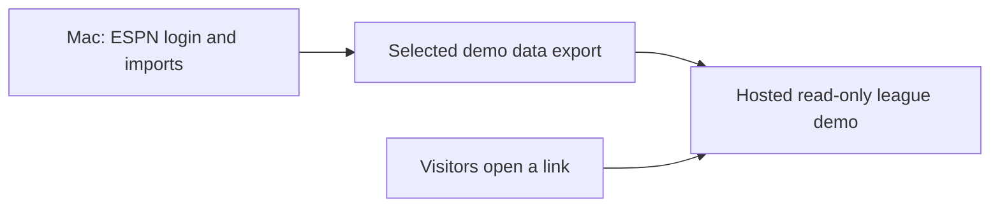

# Deployment options for a single-league demo

Research date: **September 4, 2026**. This document records options only; no public
hosting or deployment has been implemented or authorized by the research request.

## Recommendation

Use a small **Render** service for a read-only FastAPI + Angular demo if preserving
the working application and learning deployment are the priorities. Budget
**$7–$25/month** initially, measuring memory before choosing the instance size.
Use **Cloudflare Pages** for a $0 static showcase if a fixed set of exported
analyses is sufficient.

Keep ESPN login and imports on the Mac. Publish a selected demo dataset containing
only the league records and display aliases intended for sharing. Visitors browse
history, manager profiles and comparisons without connecting ESPN accounts.

## Options and trade-offs

Prices were checked September 4, 2026. Costs assume light demo traffic and exclude
custom domains, taxes, optional backups and usage overages. Railway's range is an
estimate, not a quote or a capped bill.

| Option | Monthly hosting cost | Architectural fit | Trade-off | Return for this project |
| --- | --- | --- | --- | --- |
| Render web service | $7 for 512 MB; $25 for 2 GB | One service serves Angular and FastAPI | Deployment adaptation and fixed resource limits | Best overall reuse, low operations burden and useful FastAPI deployment experience |
| Railway service | $5 minimum including $5 usage; estimate $5–$15 | Same single-application deployment | Actual consumption determines the bill | Strong alternative with convenient deployment and flexible resources |
| Cloudflare Pages | $0 for the proposed static demo | Angular reads exported data and precomputed results | No running Python backend; analysis presets and republishing required | Best cash-cost ROI for product feedback and a polished showcase |
| DigitalOcean Droplet | $6 for 1 GB; $12 for 2 GB | Full Python/DuckDB compatibility | Owner maintains server updates, HTTPS, deployment and recovery | Best infrastructure-learning ROI; more work to maintain a demo |

Sources: [Render compute pricing comparison](https://render.com/articles/render-vs-railway),
[Render compute plans](https://render.com/docs/compute-plans),
[Railway pricing](https://railway.com/pricing),
[Cloudflare Pages static pricing](https://developers.cloudflare.com/pages/functions/pricing/),
[DigitalOcean Droplet pricing](https://www.digitalocean.com/pricing/droplets).

Render's free backend sleeps after 15 minutes of inactivity and can take about a
minute to wake up. That is a poor first impression for an unattended demo link.
Paid compute avoids that sleep behavior. [Free-service limitations](https://render.com/docs/free)

## Changes needed before hosting

1. **Demo startup configuration:** load exported league data without initializing
   macOS Keychain or the browser login helper. Reuse the domain and application
   calculations through a separate composition root.
2. **Read-only API:** expose browsing and analysis; exclude imports, connection
   controls, manager edits and league switching. The current local UI header is
   not visitor authentication.
3. **Demo landing journey:** start with the league story, a few useful comparisons,
   and a visible data date. Avoid opening with connection or import setup.
4. **Public-host configuration:** adapt the existing localhost restrictions to the
   selected hostname while retaining origin/host validation.
5. **Intentional data export:** include only intended public records and aliases;
   exclude credentials, raw member references and internal ownership tokens.

A link limited to one league does not make that league private. Choose public-safe
aliases or add a viewer access gate if the audience should be restricted.

## Data and update strategy

DuckDB can remain the database for a single-process demo. A clean fixed snapshot
can ship with each deployment, and later snapshots can be published from the Mac.
The current repository initialization writes schema/checkpoint state, so a truly
read-only demo needs an appropriate read adapter or a disposable runtime copy.
Do not copy the whole private local workspace into an image or public repository.

A persistent database service is unnecessary while visitors only read. If hosted
writes are introduced later, persistence and writer ownership need a separate
design. Render disks add storage charges and support only one service instance;
attaching one also changes deployment downtime behavior.
[Persistent-disk documentation](https://render.com/docs/disks)

For Cloudflare Pages, Python computes the analyses before publication. Angular can
still provide search, season browsing and manager comparisons. Presets such as a
single season, recent three seasons and all covered seasons avoid duplicating
Python's fantasy calculations in the browser.

## ROI and decision criteria

The immediate return is useful feedback and saved development time, not revenue
that can be forecast from hosting alone. At an illustrative $50/hour, two extra
hours of setup represent $100—about fourteen months of a $7 service. These are
opportunity-cost assumptions, not measured project costs.

- Choose **Render** to preserve the app and learn a conventional backend deployment.
- Choose **Railway** if consumption billing and its workflow are preferable.
- Choose **Cloudflare Pages** when zero recurring cost and a fixed showcase dominate.
- Choose **DigitalOcean** when learning server administration is itself a goal.

A useful demo answers three questions: who repeatedly drafts a player, how a
manager's roster composition changes, and which categories their teams finish
strongly in. Track whether viewers explore those features and request their own
league before investing in multi-user authentication or automated cloud imports.

## Boundary with current implementation

The production work remains a local, read-only ESPN application. This research is
not a change to the local-only engineering rule. A future explicit deployment
request can authorize a concrete reviewed demo build and publication.
